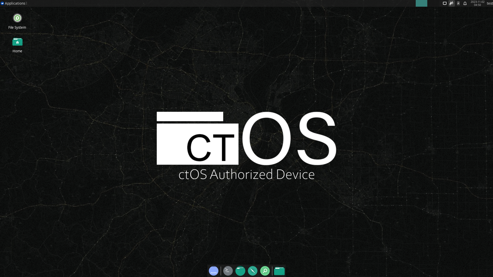

# ctOS v1.0

[]()

check **releases** section for prebuild ISO!

- **main** branch is latest stable release

- **dev** branch is development latest (unstable)

## Preview


## How to build ISO
Any Arch based system with installed **ctOS** Repo is **required** to build the ISO.
- See [ctOS](https://github.com/whatev33r/ctOS-Repo) installation Guide.

**Step 1**: Install [Archiso](https://gitlab.archlinux.org/archlinux/archiso) utility:
```
pacman -Sy archiso
```
**Step 2**: Clone repository
```
git clone https://github.com/whatev33r/ctOS-ISO.git
```
**Step 3**: Create work directory & build ISO
```
mkdir work
mkarchiso -v -w work ctOS-ISO/ISO
```


### Base sources
- [Arch-ISO](https://gitlab.archlinux.org/archlinux/archiso)
- [ALCI](https://github.com/arch-linux-calamares-installer/alci-iso)
- [EndeavourOS](https://github.com/endeavouros-team/EndeavourOS-ISO)
- [Blackarch](https://blackarch.org/)

## Custom
> To access locally builded packages etc. on the ISO put files inside the [personal](ISO/airootfs/personal) directory.
 
> To adjust the available Cowspace (for live usage) change the **cow_spacesize** parameter in the [grub config](ISO/grub/grub.cfg).
